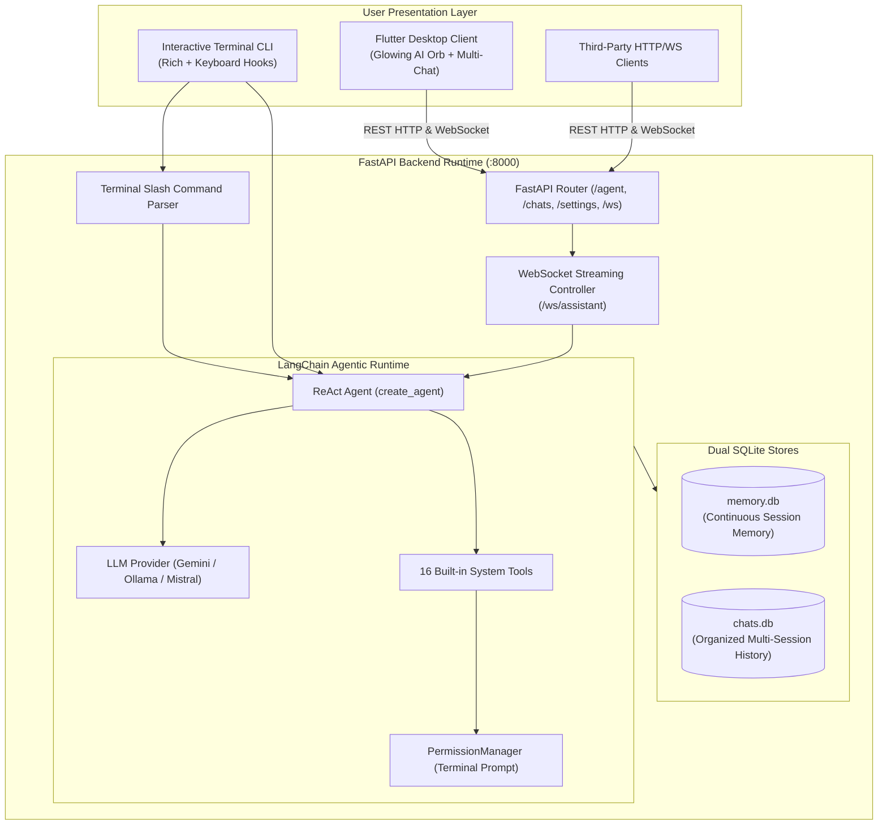

# Galaxy AI Agent — Master Documentation & Project Hub

An extensible, cross-platform personal AI desktop agent and local server ecosystem built with **FastAPI**, **LangChain**, and **Flutter Desktop**. Galaxy AI integrates a local agent runtime with multi-provider LLM support (Google Gemini, local Ollama, Mistral AI), 16 operating-system automation tools, interactive permission guards, persistent SQLite session memory, and real-time streaming WebSocket communication.

> **Single-File Documentation Control**: This root `README.md` serves as the central connection hub for the entire project. All technical guides in [`docs/`](docs/) (and [`Galaxy/docs/`](Galaxy/docs/)) are cataloged, summarized, and directly linked from this file, with reverse navigation breadcrumbs in every document.

---

## 📑 Central Documentation Hub & Master Index

Eliminate manual file checks with this single-source documentation map. Every guide in `/docs` is indexed below with its scope, target audience, and direct section links:

| # | Guide | Primary Focus | Key Sections & Direct Topics |
|---|---|---|---|
| 0 | [**Galaxy README**](Galaxy/README.md) | Full Ecosystem Overview | • [System Architecture](Galaxy/README.md#system-architecture)<br/>• [Directory Structure](Galaxy/README.md#project-structure)<br/>• [Status & Limits](Galaxy/README.md#implementation-status--limitations) |
| 1 | [**Architecture Guide**](docs/architecture.md) | System Topology & Dataflow | • [System Topology](docs/architecture.md#1-system-topology)<br/>• [Process Model](docs/architecture.md#2-process-architecture)<br/>• [LangChain ReAct Runtime](docs/architecture.md#4-agent-execution-dataflow)<br/>• [SQLite Schema (`memory.db` & `chats.db`)](docs/architecture.md#5-sqlite-database-schemas)<br/>• [Shutdown Protocol](docs/architecture.md#6-process-shutdown-architecture) |
| 2 | [**Installation Guide**](docs/installation.md) | Prerequisites & OS Packages | • [System Requirements](docs/installation.md#1-system-requirements)<br/>• [Linux (Ubuntu / Debian / Arch / Fedora)](docs/installation.md#2-platform-specific-dependencies)<br/>• [macOS Dependencies](docs/installation.md#macos-apple-silicon--intel)<br/>• [Windows Dependencies](docs/installation.md#windows-10--11)<br/>• [Health Verification](docs/installation.md#5-verification---health-check) |
| 3 | [**Configuration Guide**](docs/configuration.md) | Environment Variables & Paths | • [LLM Credentials (`GOOGLE_API_KEY`, `MISTRAL_API_KEY`)](docs/configuration.md#1-environment-variables-env)<br/>• [Network Ports (`AGENT_SERVER_RUNNING_PORT`)](docs/configuration.md#network--server-configuration)<br/>• [SMTP Credentials for Email Tool](docs/configuration.md#smtp-email-configuration-optional-for-send_email-tool)<br/>• [SQLite File Paths & Log Stores](docs/configuration.md#2-sqlite-database-configuration)<br/>• [Flutter Client Configuration](docs/configuration.md#4-flutter-desktop-client-configuration) |
| 4 | [**REST & WebSocket API**](docs/api.md) | HTTP & Streaming Contracts | • [Health Check (`GET /health`)](docs/api.md#2-health--status)<br/>• [Single Turn Agent (`POST /agent/generate`)](docs/api.md#3-agent-execution-endpoints)<br/>• [WebSocket Streaming (`ws://.../ws/assistant`)](docs/api.md#4-websocket-assistant-controller)<br/>• [Session Management (`/chats/*`)](docs/api.md#5-chat-session-management)<br/>• [Dynamic Provider Switching (`/settings/*`)](docs/api.md#provider--settings-endpoints) |
| 5 | [**CLI & Hotkeys**](docs/cli.md) | Terminal Interface & Hotkeys | • [Launch Arguments (`server=true`, `agent=true`)](docs/cli.md#1-startup-arguments-startgalaxy)<br/>• [Interactive Terminal Agent Interface](docs/cli.md#2-interactive-terminal-agent-interface)<br/>• [Slash Commands (`/help`, `/tools`, `/status`)](docs/cli.md#3-terminal-slash-commands)<br/>• [Global Shortcuts (`Ctrl+Alt+Q`, `Ctrl+Alt+Shift+C`)](docs/cli.md#4-global-keyboard-shortcuts) |
| 6 | [**Agent & LLM Engine**](docs/agent.md) | ReAct Loop, Providers & Memory | • [LangChain `create_agent` Mechanics](docs/agent.md#1-agent-engine--react-loop)<br/>• [Provider Abstraction (Gemini, Ollama, Mistral)](docs/agent.md#2-multi-provider-llm-system)<br/>• [Runtime Temperature Tuning](docs/agent.md#temperature-tuning)<br/>• [Dual SQLite Storage Architecture](docs/agent.md#3-dual-memory-system) |
| 7 | [**16 Native Tools**](docs/tools.md) | Tool Catalog & Security Guards | • [Tool Catalog Matrix](docs/tools.md#1-tool-catalog-summary)<br/>• [Filesystem & Archive Tools](docs/tools.md#filesystem-tools)<br/>• [Desktop Application Launcher](docs/tools.md#os--desktop-automation-tools)<br/>• [Interactive `PermissionManager` Prompt](docs/tools.md#3-permission-manager--interactive-guard) |
| 8 | [**Build & Packaging**](docs/build.md) | Unified C++ Builder & Release | • [Build Architecture Pipeline](docs/build.md#1-build-architecture)<br/>• [The C++ Builder (`tools/builder/build.cpp`)](docs/build.md#2-the-unified-c-builder-toolsbuilder)<br/>• [PyInstaller Server Bundling](docs/build.md#3-server-packaging-buildserversh--buildserverbat)<br/>• [Flutter Desktop Release Bundling](docs/build.md#4-client-packaging-buildagentsh--buildagentbat)<br/>• [Running Project Binaries](docs/build.md#5-running-the-project-output) |
| 9 | [**Troubleshooting**](docs/troubleshooting.md) | Error Diagnostics & FAQs | • [Missing API Key Exception (Code 404)](docs/troubleshooting.md#1-environment--api-key-errors)<br/>• [Platform `ctypes.windll` Workaround](docs/troubleshooting.md#2-platform--os-quirks)<br/>• [Port 8000 Already in Use Fix](docs/troubleshooting.md#3-network--port-conflicts)<br/>• [Ollama Connection Diagnostics](docs/troubleshooting.md#5-local-ollama-provider-issues)<br/>• [Shell Permission Denied Diagnostics](docs/troubleshooting.md#6-shell-command-execution-denied) |

*(Note: Every document above also contains a reverse link back to this master hub.)*

---

## 🔍 Developer Quick Lookup Matrix

Use this matrix to instantly jump to the exact document for common tasks without searching through directories:

| I want to... | Reference Document & Direct Section |
|---|---|
| **Build everything with a single command** | [Setup & One-Command Build](#setup--project-run-one-command-build) & [`docs/build.md`](docs/build.md#2-the-unified-c-builder-toolsbuilder) |
| **Set up API keys for Gemini, Ollama, or Mistral** | [`docs/configuration.md`](docs/configuration.md#1-environment-variables-env) |
| **Inspect or call the streaming WebSocket endpoint** | [`docs/api.md`](docs/api.md#4-websocket-assistant-controller) |
| **Inspect all 16 built-in desktop agent tools** | [`docs/tools.md`](docs/tools.md#1-tool-catalog-summary) |
| **Understand the interactive shell permission prompt** | [`docs/tools.md`](docs/tools.md#3-permission-manager--interactive-guard) |
| **Learn terminal slash commands (`/help`, `/tools`, etc.)** | [`docs/cli.md`](docs/cli.md#3-terminal-slash-commands) |
| **Use system hotkeys (`Ctrl+Alt+Q`, `Cmd+Alt+Q`)** | [`docs/cli.md`](docs/cli.md#4-global-keyboard-shortcuts) |
| **View or query the SQLite message and chat tables** | [`docs/architecture.md`](docs/architecture.md#5-sqlite-database-schemas) |
| **Switch LLM model or temperature dynamically** | [`docs/agent.md`](docs/agent.md#dynamic-provider-switching-at-runtime) & [`docs/api.md`](docs/api.md#provider--settings-endpoints) |
| **Fix `Address already in use` or port 8000 conflicts** | [`docs/troubleshooting.md`](docs/troubleshooting.md#3-network--port-conflicts) |
| **Fix missing dependencies on Linux, macOS, or Windows** | [`docs/installation.md`](docs/installation.md#2-platform-specific-dependencies) |

---

## ⚡ Setup & Project Run (One-Command Build)

Galaxy AI features an automated C++ build runner (`tools/builder/build.cpp`). **You do not need to run multiple manual setup commands across separate terminals** (`python -m venv`, `pip install`, `flutter pub get`, etc.). Compiling `build.cpp` sets up the environments, installs all dependencies, packages the backend, and compiles the native desktop app automatically in one step:

### 1. Set Your API Key

```bash
# Copy environment template
cp Galaxy/.galaxy/server/.env.example Galaxy/.galaxy/server/.env
```

Open `Galaxy/.galaxy/server/.env` and specify your LLM key:
```dotenv
GOOGLE_API_KEY="your-google-ai-studio-api-key"
# MISTRAL_API_KEY="your-mistral-api-key"   # Optional secondary provider
```

### 2. Compile `build.cpp` and Done!

**Linux / macOS:**
```bash
cd Galaxy/tools/builder
g++ -std=c++17 build.cpp -o build && ./build
```

**Windows:**
```cmd
cd Galaxy\tools\builder
g++ -std=c++17 build.cpp -o build.exe && build.exe
```

> **What `build.cpp` does automatically:**
> 1. Detects Python 3.10+, provisions `.venv`, upgrades pip, and installs all `requirements.txt` packages.
> 2. Compiles the standalone server & terminal agent binary via PyInstaller into `Galaxy/build/startGalaxy`.
> 3. Resolves Flutter client dependencies and compiles the native desktop release bundle into `Galaxy/build/`.
> 
> **Done!** Everything is ready to launch.

### 3. Run the Project Binaries

Launch the compiled executables directly from `Galaxy/build/`:

**Linux / macOS:**
```bash
# Run backend server & interactive terminal agent:
./Galaxy/build/startGalaxy

# Or launch the native Flutter desktop app:
./Galaxy/build/galaxy
```

**Windows:**
```cmd
:: Run backend server & interactive terminal agent:
Galaxy\build\startGalaxy.exe

:: Or launch the native Flutter desktop app:
Galaxy\build\galaxy.exe
```

---

## 🏛️ System Architecture Overview



For complete technical specifications on dataflows, sequence diagrams, and process lifecycles, see the [**Architecture Guide**](docs/architecture.md).

---

## 🛠️ Built-in Agent Tools (16 Tools)

All 16 tools are registered in `source/agent/agentTools.py` and exposed to the model. Detailed schemas are available in the [**Tools Reference**](docs/tools.md):

| Tool Identifier | Category | Purpose | Security Gate |
|---|---|---|:---:|
| `fetch_current_datetime` | System Info | ISO timestamp, localized time & day | Autonomous |
| `web_search` | Search | DuckDuckGo web search & scraper | Autonomous |
| `send_email` | Communication | Outgoing SMTP email dispatch | Autonomous |
| `open_browser` | System Navigation | Opens default operating system browser | Autonomous |
| `typing_tool` | Automation | Keyboard & terminal typing simulation | Autonomous |
| `inspect_user_system` | Diagnostics | CPU, RAM, platform & OS version report | Autonomous |
| `create_file` | File System | Creates UTF-8 file with directory parents | Autonomous |
| `read_file` | File System | Reads and encodes text files into prompt | Autonomous |
| `delete_file` | File System | Deletes targeted file from filesystem | Autonomous |
| `create_folder` | File System | Creates recursive folder paths | Autonomous |
| `delete_folder` | File System | Recursively deletes folder trees | Autonomous |
| `build_file_system_tree` | File System | Generates visual directory tree view | Autonomous |
| `archive_compressor` | Archiving | Compresses folders into zip, tar, gztar | Autonomous |
| `archive_extractor` | Archiving | Extracts archives into target directories | Autonomous |
| `launch_application` | OS Desktop | Cross-platform desktop application launch | Autonomous |
| `commands_executor` | Shell / Terminal | Executes shell commands in `/bin/bash` or `cmd.exe` | **Interactive Prompt (PermissionManager)** |

---

## 📁 Repository Directory Structure

```text
/
├── README.md                    # THIS FILE: Root Master Hub connecting all docs & builds
├── docs/                        # Direct symlink & path to all technical documentation
│   ├── architecture.md          # System topology & process boundaries
│   ├── installation.md          # OS dependencies & setup instructions
│   ├── configuration.md         # Environment variables & database configs
│   ├── api.md                   # REST endpoints & WebSocket streaming specs
│   ├── cli.md                   # Launch arguments, slash commands & hotkeys
│   ├── agent.md                 # LangChain ReAct loop & LLM providers
│   ├── tools.md                 # 16 agent tools & PermissionManager
│   ├── build.md                 # Unified C++ build system documentation
│   └── troubleshooting.md       # Diagnostic guide & error resolutions
│
├── Galaxy/                      # Main project workspace
│   ├── README.md                # Comprehensive project ecosystem overview
│   ├── docs/                    # Source technical documentation markdown files
│   ├── .galaxy/
│   │   ├── client/              # Flutter Desktop UI (AI Orb, chat sidebar)
│   │   └── server/              # FastAPI server, LangChain agent & SQLite databases
│   ├── scripts/                 # Platform build scripts (buildServer / buildAgent)
│   └── tools/
│       └── builder/             # Unified C++ build orchestrator (build.cpp)
│
├── src/                         # Web documentation & visualization application
├── package.json                 # Web app package manifest
└── index.html                   # Web app HTML entry point
```

---

## 🔄 Two-Way Document Connectivity Guarantee

To guarantee that users and developers never get stranded in subdirectories:

1. **Top-Level Hub (`README.md`)**: Direct links to all 9 documentation guides with anchor tags to specific sections.
2. **Document-Level Headers**: Every file in `docs/` starts with a top breadcrumb back to `[🏠 Root README / Master Index](../../README.md)`.
3. **Document-Level Footers**: Every file in `docs/` ends with a complete cross-reference matrix to every other guide in the repository.
4. **Symlink `/docs`**: The root `/docs` path is linked directly to `Galaxy/docs`, ensuring all relative paths work seamlessly across GitHub, web viewers, and local editors.
