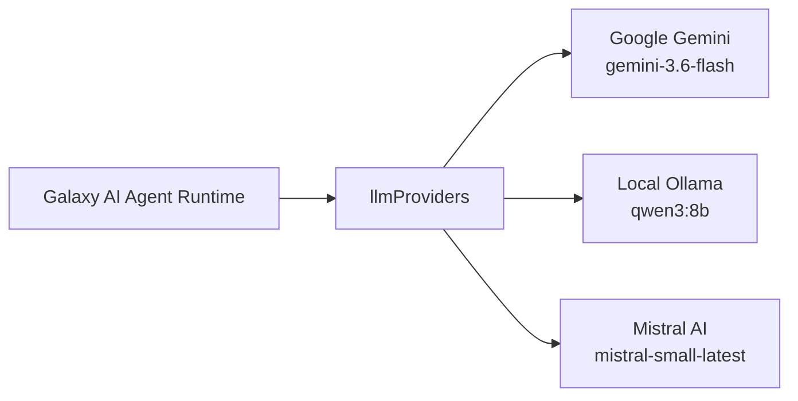

# Agent Architecture & LLM Providers

> **Galaxy AI Documentation Hub**: [🏠 Root README / Master Index](../../README.md) • [📖 Galaxy Overview](../README.md) • [📂 Docs Directory](./)

This document explains the internal mechanics of the Galaxy AI agent runtime, prompt orchestration, provider integration, and memory persistence.

---

## 1. Agent Engine & ReAct Loop

Galaxy AI uses LangChain's `create_agent` framework located in `source/agent/createNewAgent.py`:

```python
def createNewAgent(llmProviderModel):
    agent = create_agent(
        model = llmProviderModel,
        system_prompt = systemPrompt.prompt,
        tools = AGENT_TOOLS
    )
    return agent
```

### Execution Lifecycle

1. **Prompt Ingestion**: A user message arrives via the terminal input or the WebSocket endpoint.
2. **Context Assembly**: Historic messages are loaded from `memory.db` and converted into LangChain message primitives (`HumanMessage`, `AIMessageChunk`).
3. **Inference & Reasoning**: The agent invokes `agent.astream({"messages": messages}, stream_mode="messages")`.
4. **Tool Dispatching**: When the model decides to call a tool:
   - LangChain generates a `ToolMessage` with the tool name and arguments.
   - If the tool requires permission (e.g. `commands_executor`), the `PermissionManager` pauses the stream and requests user approval.
   - The tool executes and its return payload is fed back into the reasoning loop.
5. **Response Streaming & Persistence**: Tokens are emitted chunk by chunk to the user interface, and the full final response is committed back to the SQLite memory store.

---

## 2. Multi-Provider LLM System

Galaxy AI implements provider abstraction in `source/provider/llmProviders.py`.



### Supported Providers & Models

| Provider | Library Class | Default Model | Configuration Required |
|---|---|---|---|
| **Google Gemini** | `ChatGoogleGenerativeAI` | `gemini-3.6-flash` | `GOOGLE_API_KEY` in `.env` |
| **Ollama** | `ChatOllama` | `qwen3:8b` | Local Ollama daemon running on default port (`11434`) |
| **Mistral AI** | `ChatMistralAI` | `mistral-small-latest` | `MISTRAL_API_KEY` in `.env` |

### Dynamic Provider Switching at Runtime

The active model is stored in `source/agent/agent.py`:
- When `/settings/change-agent-provider` is called, the server constructs a new provider instance via `providerFunctions[newProvider]()`.
- `setNewAgentProvider()` updates the global reference.
- `createNewAgent()` rebinds the LangChain agent with the new model without terminating the FastAPI server.

### Temperature Tuning

- **Default Temperature**: `0.2` (configured in `source/provider/llmTemperatures.py`).
- **Dynamic Updates**: The `updateLLMProviderTemperature()` helper alters the temperature property on the provider object and rebuilds the agent instance.

---

## 3. Dual Memory System

To serve both continuous interactive sessions and compartmentalized chat histories, Galaxy maintains two distinct SQLite memory stores:

```text
databases/memory/
├── memory.db   # Global session log for ongoing conversation
└── chats.db    # Relational database for named chat sessions
```

### A. Flat Memory (`memory.db`)
Managed by `source/memory/agentMemory.py`:
- `initializeAgentMemory()`: Creates `messages` table with columns `(id, role, content, created_at)`.
- `loadMessagesFromAgentMemory()`: Fetches chronological history for prompt injection.
- `saveMessagesInAgentMemory(role, content)`: Appends user and assistant turns.

### B. Relational Multi-Chat Memory (`chats.db`)
Managed by `source/memory/chatHistoryMemory.py`:
- `chats`: Stores conversation headers `(id, title, created_at, updated_at)`.
- `messages`: Stores session-linked messages with foreign-key constraint and cascade deletion:
  ```sql
  FOREIGN KEY (chat_id) REFERENCES chats(id) ON DELETE CASCADE
  ```
- Fast querying is enabled by an index on `chat_id` (`idx_messages_chat_id`).

---

## 📚 Central Documentation Hub

All technical documentation is connected to and managed centrally from the root [**README.md**](../../README.md).

| Document | Focus & Topic | Link |
|---|---|:---:|
| **Central Hub** | Root README, Master Index & One-Command Build | [README.md](../../README.md) |
| **Project Overview** | Complete Ecosystem & Architecture Summary | [Galaxy/README.md](../README.md) |
| **System Architecture** | Process Boundaries, Sequence Flows & Dataflow | [architecture.md](architecture.md) |
| **Installation Guide** | Prerequisites & OS Packages (Linux, macOS, Windows) | [installation.md](installation.md) |
| **Configuration Guide** | `.env` Variables, SQLite Stores & SMTP Settings | [configuration.md](configuration.md) |
| **API & WebSocket** | REST Endpoints, Payloads & Streaming Events | [api.md](api.md) |
| **CLI & Hotkeys** | Flags (`server=true`), Slash Commands & Hotkeys | [cli.md](cli.md) |
| **Agent & LLM Engine** | LangChain ReAct Loop, Multi-Provider & Memory | [agent.md](agent.md) |
| **16 Native Tools** | Tool Signatures, Parameters & Interactive Guard | [tools.md](tools.md) |
| **Build & Packaging** | Unified C++ Builder (`build.cpp`) & Bundling | [build.md](build.md) |
| **Troubleshooting** | API Key Errors, Port Conflicts & FAQs | [troubleshooting.md](troubleshooting.md) |

