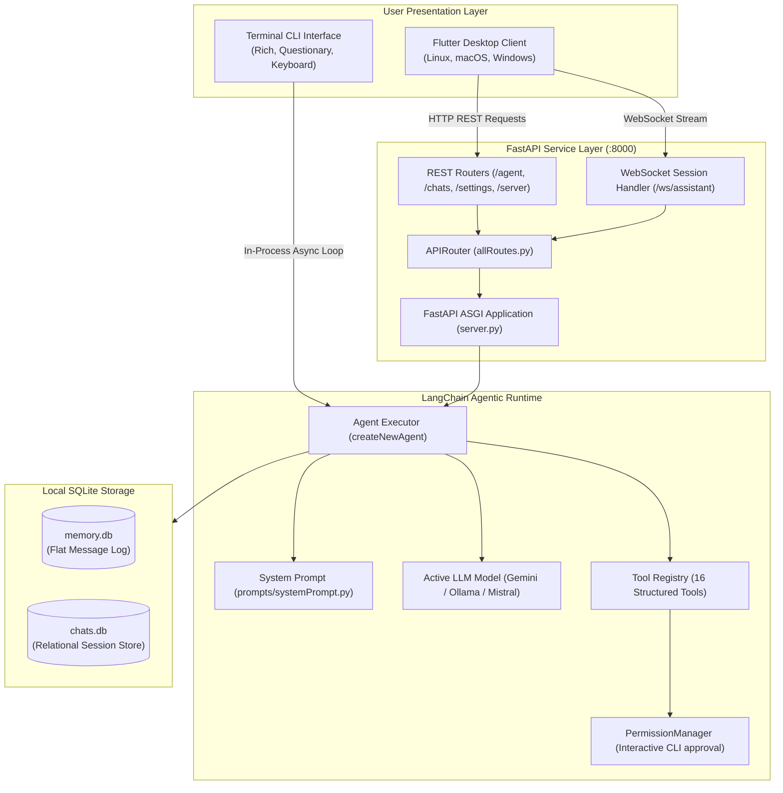
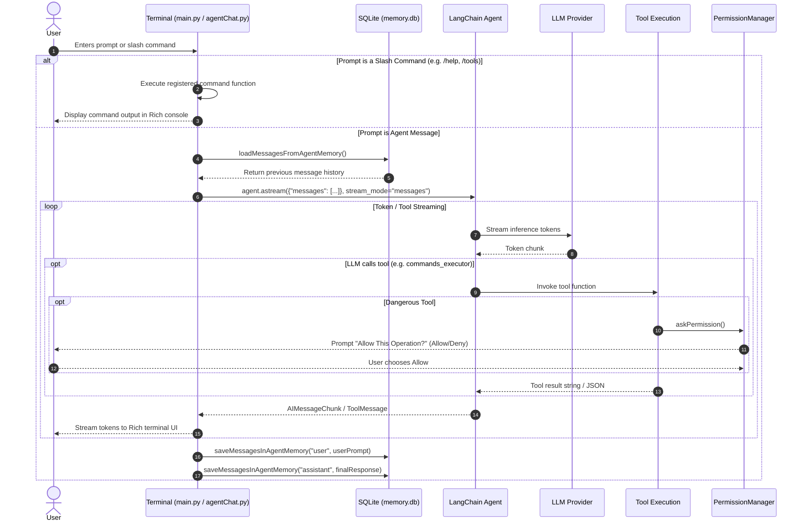
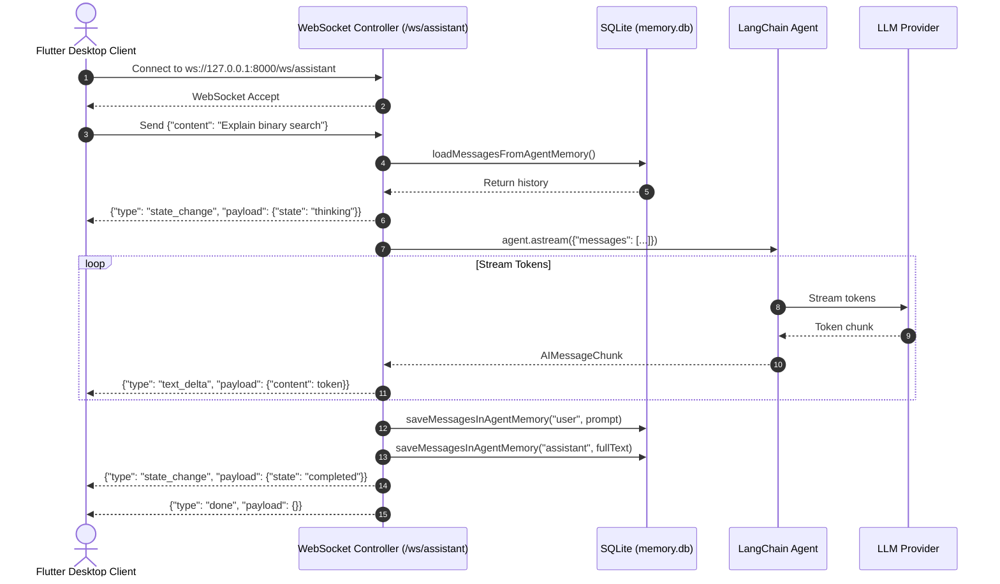
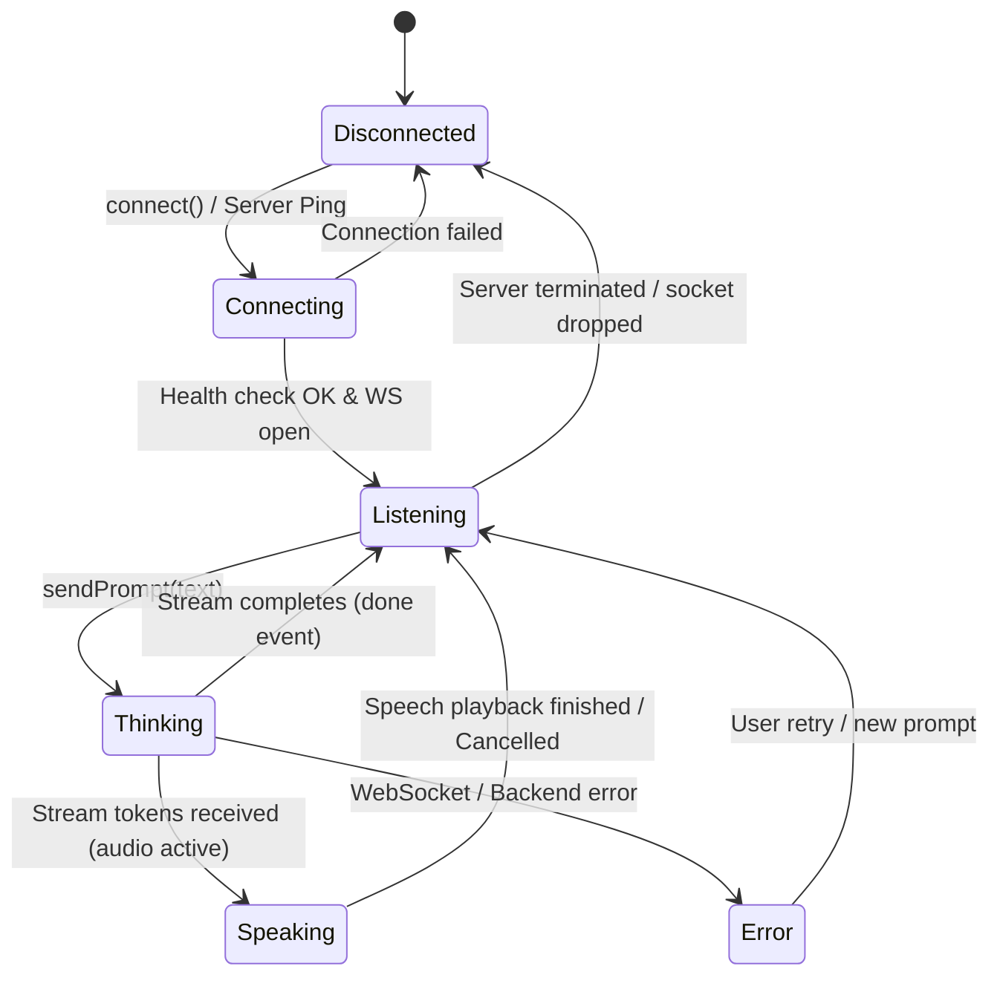

# Galaxy AI Agent Architecture

> **Galaxy AI Documentation Hub**: [🏠 Root README / Master Index](../../README.md) • [📖 Galaxy Overview](../README.md) • [📂 Docs Directory](./)

This document provides a comprehensive technical overview of the software architecture of Galaxy AI Agent, including process models, communication boundaries, agent runtime loops, and state management.

---

## 1. System Topology

Galaxy AI Agent is designed as a hybrid client-server desktop system composed of three primary operational tiers:



---

## 2. Process Architecture

When launched via `python startGalaxy.py`, two primary processes are instantiated depending on the provided arguments:

1. **Uvicorn Server Daemon Process**:
   - Spawned as a background subprocess via `subprocess.Popen([sys.executable, "-m", "uvicorn", "server:agentServer", "--host", "127.0.0.1", "--port", ...])`.
   - On Windows, uses `creationflags = subprocess.CREATE_NO_WINDOW` to avoid visual clutter.
   - Redirects stdout and stderr to rotating daily log files in `source/logs/` (e.g. `Server_YYYY-MM-DD.log`).
   - Stores the active process ID in `source/logs/server.pid` for graceful shutdown and process lifecycle management.

2. **Interactive Terminal Agent Process**:
   - Launched either in the current terminal or in a new terminal window via `startNewTerminal([sys.executable, "main.py"], "Galaxy AI - Agent")`.
   - Spawns background worker threads:
     - `startKeyboardMappingThread()`: Listens for system-wide hotkeys using the `keyboard` library.
     - `AgentChatModeThread`: Runs the `asyncio` event loop driving the interactive chat prompt, Rich streaming output, and CLI slash-command executor.

3. **Flutter Desktop Process (Optional)**:
   - An independent native GUI process communicating over local loopback (`http://127.0.0.1:8000` and `ws://127.0.0.1:8000/ws/assistant`).

---

## 3. End-to-End Request & Data Flows

### A. Terminal CLI Chat Flow



### B. WebSocket Streaming Flow (Flutter / GUI Client)



---

## 4. State Management and Transitions

The Flutter desktop application maintains state through the `AssistantController` and visualizes state via the animated `AiOrb` widget:



| State | Orb Visual Behavior | Description |
|---|---|---|
| `disconnected` | Dim gray / pulsing red border | Server is unreachable or offline on port 8000. |
| `connecting` | Cyan/purple gentle breathing pulse | Attempting handshake with backend. |
| `listening` (idle) | Deep neon blue/indigo ambient wave | Ready for user audio or text input. |
| `thinking` | High-frequency purple/magenta energy orbit | Agent is reasoning or invoking tools. |
| `speaking` | Dynamic audio-reactive cyan/violet pulse | Assistant is streaming voice or completing output. |
| `error` | Amber/red alert glow | Request failed, timeout, or invalid response. |

---

## 5. Storage Architecture

Galaxy AI maintains two decoupled SQLite databases in `Galaxy/.galaxy/server/databases/memory/`:

### A. Agent Message Memory (`memory.db`)
Used by `agentResponse.py`, `agentWebSocketController.py`, and `agentChat.py` for standard ongoing conversational memory.

```sql
CREATE TABLE messages (
    id INTEGER PRIMARY KEY AUTOINCREMENT,
    role TEXT NOT NULL,
    content TEXT NOT NULL,
    created_at TIMESTAMP DEFAULT CURRENT_TIMESTAMP
);
```

### B. Session Chat Memory (`chats.db`)
Used by the Flutter client and `/chats/*` endpoints to manage distinct titled conversations:

```sql
CREATE TABLE chats (
    id INTEGER PRIMARY KEY AUTOINCREMENT,
    title TEXT NOT NULL UNIQUE,
    created_at TIMESTAMP DEFAULT CURRENT_TIMESTAMP NOT NULL,
    updated_at TIMESTAMP DEFAULT CURRENT_TIMESTAMP NOT NULL
);

CREATE TABLE messages (
    id INTEGER PRIMARY KEY AUTOINCREMENT,
    chat_id INTEGER NOT NULL,
    role TEXT NOT NULL,
    content TEXT NOT NULL,
    created_at TIMESTAMP DEFAULT CURRENT_TIMESTAMP NOT NULL,
    FOREIGN KEY (chat_id) REFERENCES chats(id) ON DELETE CASCADE
);

CREATE INDEX idx_messages_chat_id ON messages(chat_id);
```

---

## 6. Process Shutdown Architecture

When the user triggers `/terminate-server` or `GET /server/disconnect`:
1. The server reads `source/logs/server.pid`.
2. Inspects process table using `psutil`.
3. Verifies process name contains `python` or `uvicorn` and terminates the PID.
4. Scans open sockets for processes listening on `AGENT_SERVER_RUNNING_PORT` (default 8000) and terminates matches.
5. Returns `HTTP 204 No Content` to the calling client before completing shutdown.

---

## 📚 Central Documentation Hub

All technical documentation is connected to and managed centrally from the root [**README.md**](../../README.md).

| Document | Focus & Topic | Link |
|---|---|:---:|
| **Central Hub** | Root README, Master Index & One-Command Build | [README.md](../../README.md) |
| **Project Overview** | Complete Ecosystem & Architecture Summary | [Galaxy/README.md](../README.md) |
| **System Architecture** | Process Boundaries, Sequence Flows & Dataflow | [architecture.md](architecture.md) |
| **Installation Guide** | Prerequisites & OS Packages (Linux, macOS, Windows) | [installation.md](installation.md) |
| **Configuration Guide** | `.env` Variables, SQLite Stores & SMTP Settings | [configuration.md](configuration.md) |
| **API & WebSocket** | REST Endpoints, Payloads & Streaming Events | [api.md](api.md) |
| **CLI & Hotkeys** | Flags (`server=true`), Slash Commands & Hotkeys | [cli.md](cli.md) |
| **Agent & LLM Engine** | LangChain ReAct Loop, Multi-Provider & Memory | [agent.md](agent.md) |
| **16 Native Tools** | Tool Signatures, Parameters & Interactive Guard | [tools.md](tools.md) |
| **Build & Packaging** | Unified C++ Builder (`build.cpp`) & Bundling | [build.md](build.md) |
| **Troubleshooting** | API Key Errors, Port Conflicts & FAQs | [troubleshooting.md](troubleshooting.md) |

