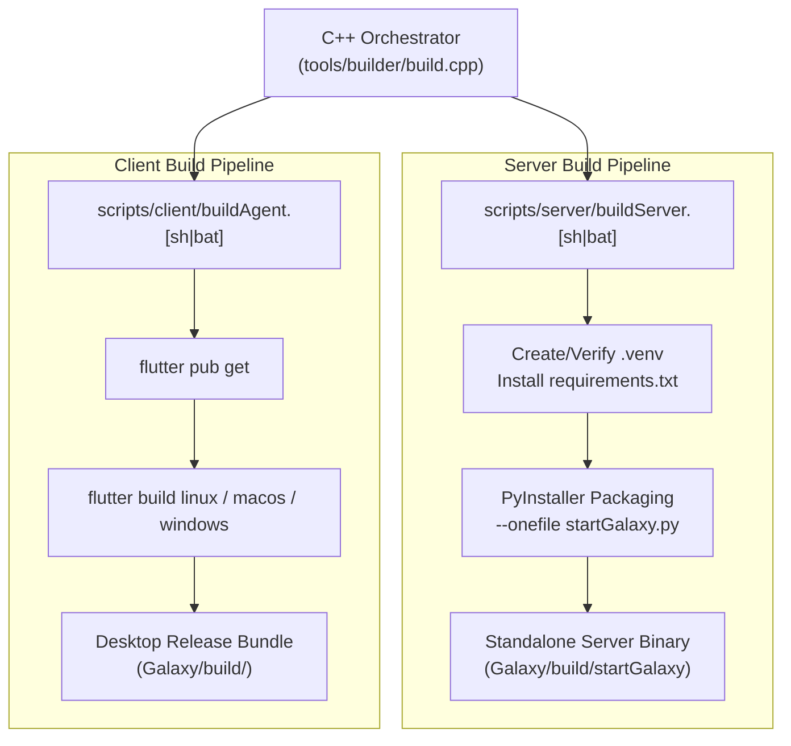

# Build System & Release Packaging

> **Galaxy AI Documentation Hub**: [🏠 Root README / Master Index](../../README.md) • [📖 Galaxy Overview](../README.md) • [📂 Docs Directory](./)

Galaxy AI Agent includes a dual packaging workflow orchestrated either through a unified C++ build runner or individual platform scripts.

---

## 1. Build Architecture



---

## 2. The Unified C++ Builder (`tools/builder`)

The builder orchestrator is located at `Galaxy/tools/builder/`:
- **`build.cpp`**: Main entry point invoking `ExecuteScript`.
- **`buildConfigurations.h`**: Defines script relative paths (`scripts/server/buildServer` and `scripts/client/buildAgent`).
- **`executeScript.h`**: Detects OS at compile and runtime (`_WIN32`, `__APPLE__`, `__linux__`), appends `.bat` or `.sh`, and executes the commands.

### Compiling and Running the Builder

```bash
cd Galaxy/tools/builder
g++ -std=c++17 build.cpp -o build
./build
```

On Windows (using MinGW or MSVC):
```cmd
cd Galaxy\tools\builder
g++ -std=c++17 build.cpp -o build.exe
build.exe
```

---

## 3. Server Packaging (`buildServer.sh` / `buildServer.bat`)

The server build script executes the following steps:

1. **System Detection**:
   - Detects Linux distribution (`apt`, `pacman`, `dnf`, `zypper`) and offers automated Python installation if missing.
2. **Environment Isolation**:
   - Creates a dedicated virtual environment in `.galaxy/server/.venv`.
   - Upgrades `pip` and installs all packages from `requirements.txt`.
3. **PyInstaller Binary Generation**:
   - Compiles `startGalaxy.py` into a single standalone binary using:
     ```bash
     pyinstaller --onefile .galaxy/server/startGalaxy.py \
         --distpath Galaxy/build \
         --workpath Galaxy/build/cache \
         --specpath Galaxy/build/data/server
     ```
   - Emits the compiled executable to `Galaxy/build/`.

---

## 4. Client Packaging (`buildAgent.sh` / `buildAgent.bat`)

The client build script compiles the Flutter desktop frontend:

1. **Flutter Detection**:
   - Verifies the availability of `flutter` in the system `PATH`.
2. **Dependency Resolution**:
   - Navigates to `Galaxy/.galaxy/client` and runs `flutter pub get`.
3. **Release Build**:
   - **Linux**: Runs `flutter build linux`, locating the output in `build/linux/x64/release/bundle`.
   - **macOS**: Runs `flutter build macos`, locating the `.app` bundle in `build/macos/Build/Products/Release`.
   - **Windows**: Runs `flutter build windows`, locating the output in `build\windows\x64\runner\Release`.
4. **Assembly**:
   - Copies the complete executable and resource bundle into `Galaxy/build/`.
   - Executes `flutter clean` to clean temporary compile artifacts.

---

## 5. Running the Project Output

Once `build.cpp` has finished compiling, the executables are ready in `Galaxy/build/`. You can run them directly without any manual installation commands:

### Linux / macOS:
```bash
# Launch FastAPI backend server and interactive CLI agent:
./Galaxy/build/startGalaxy

# Launch Flutter desktop assistant client:
./Galaxy/build/galaxy
```

### Windows:
```cmd
:: Launch backend server and interactive CLI agent:
Galaxy\build\startGalaxy.exe

:: Launch Flutter desktop assistant client:
Galaxy\build\galaxy.exe
```

---

## 📚 Central Documentation Hub

All technical documentation is connected to and managed centrally from the root [**README.md**](../../README.md).

| Document | Focus & Topic | Link |
|---|---|:---:|
| **Central Hub** | Root README, Master Index & One-Command Build | [README.md](../../README.md) |
| **Project Overview** | Complete Ecosystem & Architecture Summary | [Galaxy/README.md](../README.md) |
| **System Architecture** | Process Boundaries, Sequence Flows & Dataflow | [architecture.md](architecture.md) |
| **Installation Guide** | Prerequisites & OS Packages (Linux, macOS, Windows) | [installation.md](installation.md) |
| **Configuration Guide** | `.env` Variables, SQLite Stores & SMTP Settings | [configuration.md](configuration.md) |
| **API & WebSocket** | REST Endpoints, Payloads & Streaming Events | [api.md](api.md) |
| **CLI & Hotkeys** | Flags (`server=true`), Slash Commands & Hotkeys | [cli.md](cli.md) |
| **Agent & LLM Engine** | LangChain ReAct Loop, Multi-Provider & Memory | [agent.md](agent.md) |
| **16 Native Tools** | Tool Signatures, Parameters & Interactive Guard | [tools.md](tools.md) |
| **Build & Packaging** | Unified C++ Builder (`build.cpp`) & Bundling | [build.md](build.md) |
| **Troubleshooting** | API Key Errors, Port Conflicts & FAQs | [troubleshooting.md](troubleshooting.md) |

