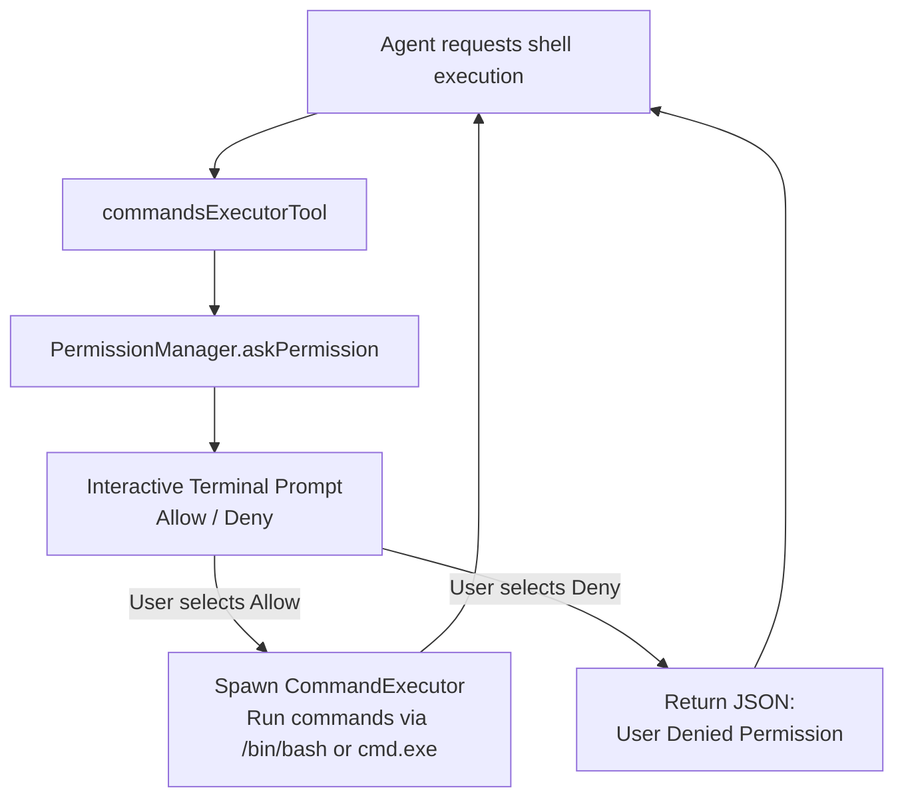

# Agent Tools Reference & Security Model

> **Galaxy AI Documentation Hub**: [🏠 Root README / Master Index](../../README.md) • [📖 Galaxy Overview](../README.md) • [📂 Docs Directory](./)

Galaxy AI Agent equips the LLM with 16 native desktop and system tools registered in `source/agent/agentTools.py`. This document covers tool signatures, execution mechanics, and security controls.

---

## 1. Tool Catalog Summary

| Tool Name | Identifier | Category | Permission Required |
|---|---|---|:---:|
| Fetch Date & Time | `fetch_current_datetime` | System Info | No |
| Web Search | `web_search` | Information Retrieval | No |
| Send Email | `send_email` | Communication | No |
| Open Web Browser | `open_browser` | System Navigation | No |
| Typing Simulation | `typing_tool` | Automation | No |
| Inspect User System | `inspect_user_system` | System Diagnostics | No |
| Create Folder | `create_folder` | File System | No |
| Delete Folder | `delete_folder` | File System | No |
| Create File | `create_file` | File System | No |
| Read File | `read_file` | File System | No |
| Delete File | `delete_file` | File System | No |
| Build File System Tree | `build_file_system_tree` | File System | No |
| Archive Compressor | `archive_compressor` | Archiving | No |
| Archive Extractor | `archive_extractor` | Archiving | No |
| Launch Desktop App | `launch_application` | OS Desktop | No |
| Commands Executor | `commands_executor` | Shell / Terminal | **Yes (Interactive)** |

---

## 2. Detailed Tool Documentation

### System & Information Tools

#### 1. `fetch_current_datetime`
- **File**: `source/tools/datetimeFetchingTool.py`
- **Purpose**: Returns the current ISO date, localized time, day of the week, and timezone.
- **Parameters**: None.

#### 2. `web_search`
- **File**: `source/tools/webSearchTool.py`
- **Purpose**: Performs real-time internet search using DuckDuckGo / web scraping to fetch recent web results.
- **Parameters**:
  - `query` (str): Search search phrase or question.
  - `max_results` (int, default: 5): Maximum number of search snippets to return.

#### 3. `inspect_user_system`
- **File**: `source/tools/inspectUserSystemTool.py`
- **Purpose**: Inspects hardware and platform information including OS name, release version, CPU core count, RAM usage, and active username.
- **Parameters**: None.

---

### Communication & Navigation Tools

#### 4. `send_email`
- **File**: `source/tools/sendEmaillTool.py`
- **Purpose**: Sends emails via SMTP using the credentials configured in `.env`.
- **Parameters**:
  - `recipient_email` (str): Target email address.
  - `subject` (str): Email subject line.
  - `body` (str): Email text content.

#### 5. `open_browser`
- **File**: `source/tools/openBrowserTool.py`
- **Purpose**: Opens a given URL in the user's default web browser using Python's `webbrowser` library.
- **Parameters**:
  - `url` (str): The destination URL (e.g. `https://github.com`).

#### 6. `typing_tool`
- **File**: `source/tools/TypingTool.py`
- **Purpose**: Simulates keystroke typing animations in the terminal or active output buffer.
- **Parameters**:
  - `text` (str): Text string to simulate.
  - `speed` (float, default: 0.05): Interval delay between characters.

---

### File System Tools

#### 7. `create_folder` & 8. `delete_folder`
- **Files**: `source/tools/fileSystem/createFolderTool.py`, `deleteFolderTool.py`
- **Purpose**: Creates directory trees or removes directories recursively.
- **Parameters**: `folder_path` (str).

#### 9. `create_file` & 10. `read_file` & 11. `delete_file`
- **Files**: `source/tools/fileSystem/createFileTool.py`, `readFileTool.py`, `deleteFileTool.py`
- **Purpose**: Manages file creation with UTF-8 encoding, reads text file contents into agent context, and deletes files.
- **Parameters**:
  - `file_path` (str)
  - `content` (str, for creation only)

#### 12. `build_file_system_tree`
- **File**: `source/tools/fileSystem/buildFileSystemTreeTool.py`
- **Purpose**: Generates an ASCII/Unicode directory tree representation up to a configured max depth.
- **Parameters**:
  - `root_path` (str): Starting directory.
  - `max_depth` (int, default: 3): Tree traversal limit.

---

### Archive Tools

#### 13. `archive_compressor`
- **File**: `source/tools/fileSystem/archive/archiveCompressorTool.py`
- **Purpose**: Compresses directories or files into `.zip`, `.tar`, `.tar.gz`, or `.tar.bz2` archives.
- **Parameters**:
  - `source_path` (str): Target folder or file.
  - `output_archive` (str): Output archive destination path.
  - `format` (str): Compression format (`zip`, `gztar`, `bztar`, `tar`).

#### 14. `archive_extractor`
- **File**: `source/tools/fileSystem/archive/archiveExtractorTool.py`
- **Purpose**: Extracts compressed archives safely into a target directory.
- **Parameters**:
  - `archive_path` (str): Path to the archive.
  - `destination_folder` (str): Extraction target.

---

### Desktop OS & Execution Tools

#### 15. `launch_application`
- **File**: `source/tools/launchDesktopApplicationTool.py`
- **Purpose**: Discovers and launches local desktop applications on Windows, Linux, and macOS.
- **Implementation**:
  Uses `ApplicationLauncherFactory`:
  - **Windows**: Checks `PATH`, Start Menu shortcuts (`.lnk`), Desktop shortcuts, and Windows Registry (`HKLM` / `HKCU`).
  - **Linux**: Scans `PATH` and `.desktop` files in `/usr/share/applications` and `~/.local/share/applications`.
  - **macOS**: Scans `PATH`, `/Applications`, and `~/Applications` for `.app` bundles.
- **Parameters**:
  - `app_name` (str): The common name of the application (e.g. `chrome`, `vlc`, `spotify`, `code`).

#### 16. `commands_executor`
- **File**: `source/tools/commandsExecutorTool.py`
- **Purpose**: Sequentially executes system shell commands in a persistent shell session (`cmd.exe` on Windows, `/bin/bash` on Linux/macOS).
- **Parameters**:
  - `commands` (list[str]): List of shell commands to execute (e.g. `["ls -la", "git status"]`).

---

## 3. Security & Permission System

To prevent unintended changes or malicious command execution, dangerous tools like `commands_executor` are mediated by `PermissionManager` (`source/security/permissionManager.py`):



### Prompt Display in Terminal
```text
┌─ AI Agent Permission Required For "commands_executor" Tool ─────────────────┐
│ AI Agent Wants To Run Commands :                                             │
│ ['rm -rf build/temp', 'git pull']                                            │
└─────────────────────────────────────────────────────────────────────────────┘
? Allow This Operation? 
 > Allow
   Deny
```

If the user selects **Deny**, the tool immediately halts execution and returns a structured rejection response:
```json
{
  "Success": false,
  "Status": "Permission Denied!",
  "Tool Name": "commands_executor",
  "Information": "User Denied For This commands_executor Tool Operation"
}
```
The agent receives this feedback and informs the user that the action was cancelled as requested.

---

## 📚 Central Documentation Hub

All technical documentation is connected to and managed centrally from the root [**README.md**](../../README.md).

| Document | Focus & Topic | Link |
|---|---|:---:|
| **Central Hub** | Root README, Master Index & One-Command Build | [README.md](../../README.md) |
| **Project Overview** | Complete Ecosystem & Architecture Summary | [Galaxy/README.md](../README.md) |
| **System Architecture** | Process Boundaries, Sequence Flows & Dataflow | [architecture.md](architecture.md) |
| **Installation Guide** | Prerequisites & OS Packages (Linux, macOS, Windows) | [installation.md](installation.md) |
| **Configuration Guide** | `.env` Variables, SQLite Stores & SMTP Settings | [configuration.md](configuration.md) |
| **API & WebSocket** | REST Endpoints, Payloads & Streaming Events | [api.md](api.md) |
| **CLI & Hotkeys** | Flags (`server=true`), Slash Commands & Hotkeys | [cli.md](cli.md) |
| **Agent & LLM Engine** | LangChain ReAct Loop, Multi-Provider & Memory | [agent.md](agent.md) |
| **16 Native Tools** | Tool Signatures, Parameters & Interactive Guard | [tools.md](tools.md) |
| **Build & Packaging** | Unified C++ Builder (`build.cpp`) & Bundling | [build.md](build.md) |
| **Troubleshooting** | API Key Errors, Port Conflicts & FAQs | [troubleshooting.md](troubleshooting.md) |

